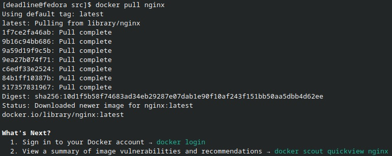
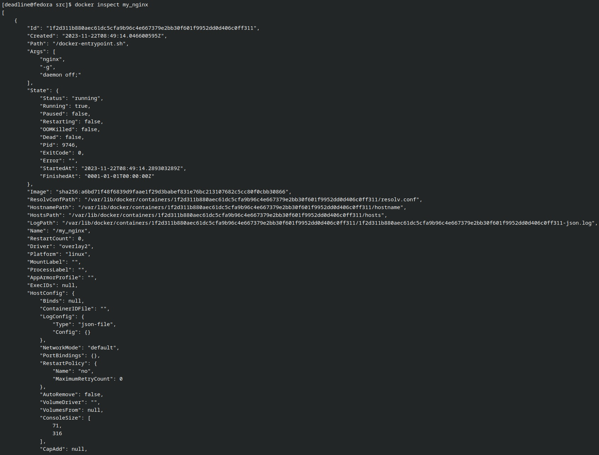
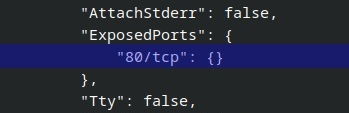
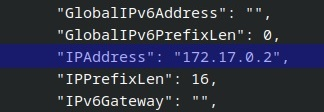
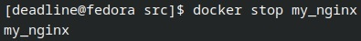
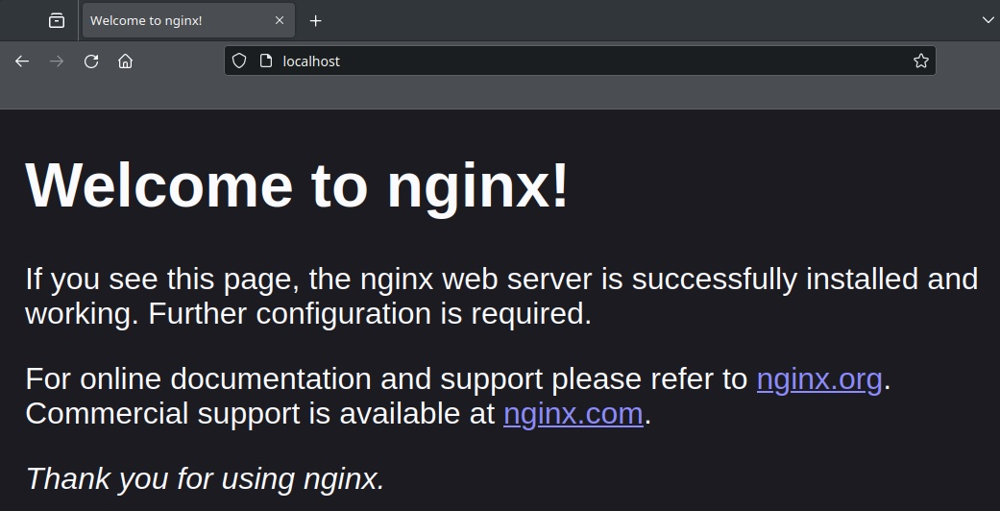

# Simple Docker

Введение в докер. Разработка простого докер образа для собственного сервера.

## Оглавление

1. [Part 1. Инструмент ipcalc](#part-1-готовый-докер)  

## Part 1. Готовый докер

- Взять официальный докер образ с **nginx** и выкачать его при помощи `docker pull`  

`docker pull nginx`  
  

- Проверить наличие докер образа через `docker images`  

`docker images`  
  

- Запустить докер образ через `docker run -d [image_id|repository]`  

`docker run -d --name my_nginx nginx`  

- Проверить, что образ запустился через `docker ps`  

`docker ps`  

- Посмотреть информацию о контейнере через `docker inspect [container_id|container_name]`  

`docker inspect my_nginx`  

- По выводу команды определить размер контейнера, список замапленных портов и ip контейнера  

1) Размер контейнера:

2) Список замапленных портов:

3) IP контейнера:

- Остановить докер образ через `docker stop [container_id|container_name]`  

`docker stop my_nginx`  

- Проверить, что образ остановился через `docker ps`  

`docker ps -a`  

- Запустить докер с портами 80 и 443 в контейнере, замапленными на такие же порты на локальной машине, через команду *run*  

`sudo docker run -d -p 80:80 -p 443:443 nginx`  

- Проверить, что в браузере по адресу *localhost:80* доступна стартовая страница **nginx**  

- Перезапустить докер контейнер через `docker restart [container_id|container_name]`  

`docker restart 7baedf41265a`  

- Проверить любым способом, что контейнер запустился  

`docker ps`  
