# Simple Docker

Введение в докер. Разработка простого докер образа для собственного сервера.

## Оглавление

1. [Part 1. Готовый докер](#part-1-готовый-докер)
2. [Part 2. Операции с контейнером](#part-2-операции-с-контейнером)
3. [Part 3. Мини веб-сервер](#part-3-мини-веб-сервер)

## Part 1. Готовый докер

- Взять официальный докер образ с **nginx** и выкачать его при помощи `docker pull`  

`docker pull nginx`  
  

- Проверить наличие докер образа через `docker images`  

`docker images`  
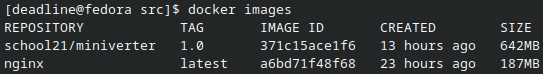  

- Запустить докер образ через `docker run -d [image_id|repository]`  

`docker run -d --name my_nginx nginx`  
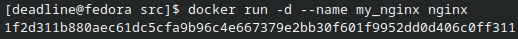

- Проверить, что образ запустился через `docker ps`  

`docker ps`  
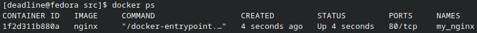

- Посмотреть информацию о контейнере через `docker inspect [container_id|container_name]`  

`docker inspect my_nginx`  

- По выводу команды определить размер контейнера, список замапленных портов и ip контейнера  

1) Размер контейнера:

2) Список замапленных портов:

3) IP контейнера:

- Остановить докер образ через `docker stop [container_id|container_name]`  

`docker stop my_nginx`  

- Проверить, что образ остановился через `docker ps`  

`docker ps -a`  
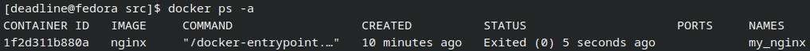

- Запустить докер с портами 80 и 443 в контейнере, замапленными на такие же порты на локальной машине, через команду *run*  

`sudo docker run -d -p 80:80 -p 443:443 nginx`  
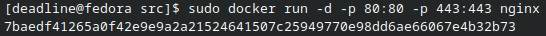

- Проверить, что в браузере по адресу *localhost:80* доступна стартовая страница **nginx**  

- Перезапустить докер контейнер через `docker restart [container_id|container_name]`  

`docker restart 7baedf41265a`  
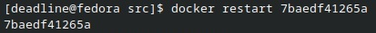

- Проверить любым способом, что контейнер запустился  

`docker ps`  
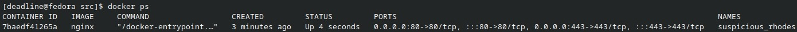

## Part 2. Операции с контейнером

- Прочитать конфигурационный файл *nginx.conf* внутри докер контейнера через команду *exec*  

`docker run -d -p 80:80 --name part2 nginx`  
`docker exec part2 cat /etc/nginx/nginx.conf`  
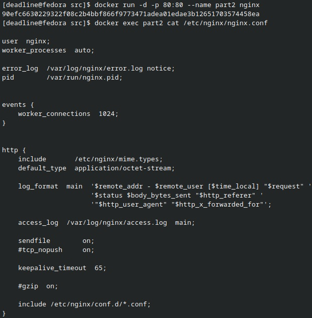  

- Создать на локальной машине файл *nginx.conf*  

`touch nginx.conf`  
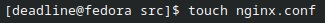  

- Настроить в нем по пути */status* отдачу страницы статуса сервера **nginx**  

`vim nginx.conf`  
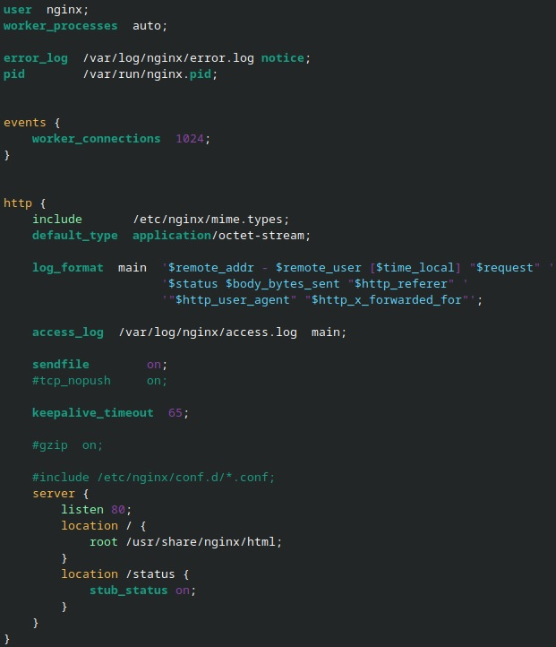  

- Скопировать созданный файл *nginx.conf* внутрь докер образа через команду `docker cp`  

`docker cp nginx.conf part2:/etc/nginx/`  
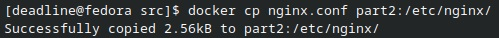  

- Перезапустить **nginx** внутри докер образа через команду *exec*  

`docker exec part2 nginx -s reload`  
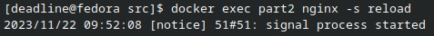  

- Проверить, что по адресу *localhost:80/status* отдается страничка со статусом сервера **nginx**  

`curl localhost:80/status`  
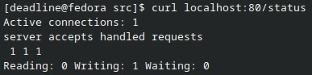  

- Экспортировать контейнер в файл *container.tar* через команду *export*  

`docker export part2 > container.tar`  
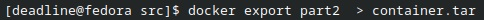  

- Остановить контейнер  

`docker stop part2`  
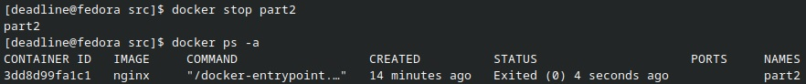  

- Удалить образ через `docker rmi [image_id|repository]`, не удаляя перед этим контейнеры  

`docker rmi nginx -f`  
`docker images`  
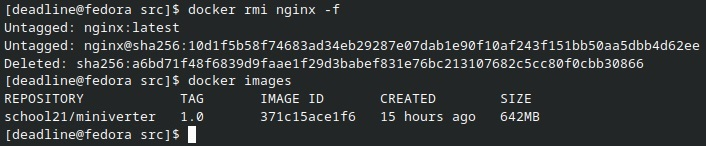  

- Удалить остановленный контейнер  

`docker rm part2`  
`docker ps -a`  
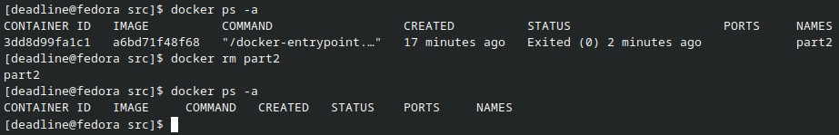  

- Импортировать контейнер обратно через команду *import*  

`sudo docker import -c 'cmd ["nginx", "-g", "daemon off;"]' -c 'ENTRYPOINT ["/docker-entrypoint.sh"]' container.tar import_nginx`  
`docker images`  
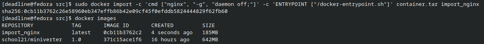  

- Запустить импортированный контейнер  

`docker run -d -p 80:80 --name import_part2 import_nginx`  
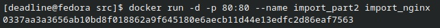  

- Проверить, что по адресу *localhost:80/status* отдается страничка со статусом сервера **nginx**  

`curl localhost:80/status`  
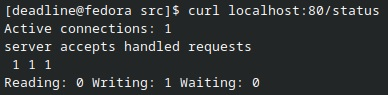  

## Part 3. Мини веб-сервер

- Написать мини сервер на **C** и **FastCgi**, который будет возвращать простейшую страничку с надписью `Hello World!`  

`vim miniserver.c`  
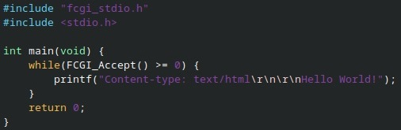  

- Написать свой *nginx.conf*, который будет проксировать все запросы с 81 порта на *127.0.0.1:8080*  

`vim nginx.conf`  
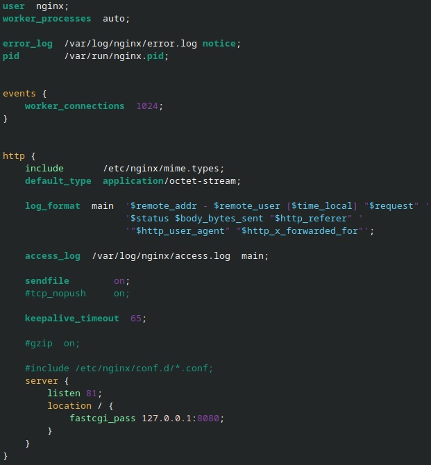  

- Запустить написанный мини сервер через *spawn-fcgi* на порту 8080  

1) Загрузить заново образ с **nginx**:

`docker pull nginx`  
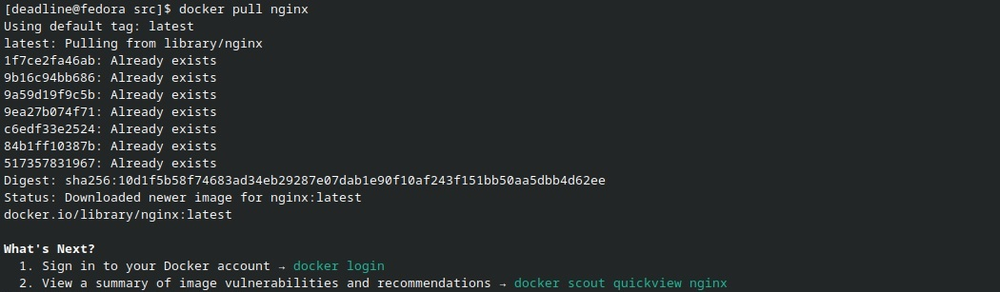  

2) Проверить наличие образа **nginx**:

`docker images`  
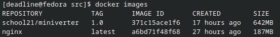  

3) Запустить контейнер с образа **nginx**:

`docker run -d -p 81:81 --name part3 nginx`  
  

4) Проверить наличие контейнера с образа **nginx**:

`docker ps`  
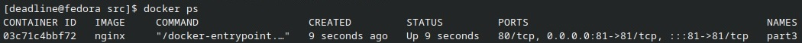  

5) Скопировать созданные файлы *nginx.conf* и *miniserver.c* внутрь докер образа через команду `docker cp`:

`docker cp nginx.conf part3:/etc/nginx/`  
`docker cp miniserver.c part3:/home/`  
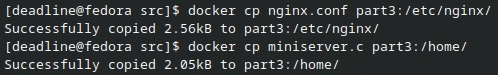  

6) Запустить интерактивную оболочку внутри запущенного докер-контейнера:

`docker exec -it part3 bash`  
  

7) Запустить установку gcc компилятора, утилиты spawn-fcgi и библиотеки libfcgi-dev:

`apt-get update`  
`apt-get install gcc`  
`apt-get install spawn-fcgi`  
`apt-get install libfcgi-dev`  
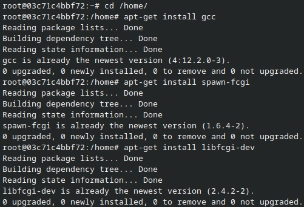  

8) Скомпилировать miniserver.c:

`gcc miniserver.c -lfcgi -o mini`  
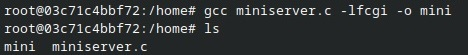  

9) Запуск FastCGI-сервера с использованием spawn-fcgi:

`spawn-fcgi -p 8080 mini`  
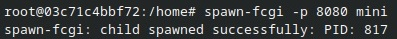  

10) Перезагрузка конфигурации Nginx:

`nginx -s reload`  
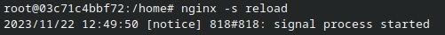  

- Проверить, что в браузере по *localhost:81* отдается написанная вами страничка  

`curl localhost:81`  
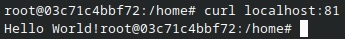  

- Положить файл *nginx.conf* по пути *./nginx/nginx.conf* (это понадобится позже)  

`mkdir nginx`  
`mv nginx.conf nginx`  
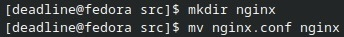  